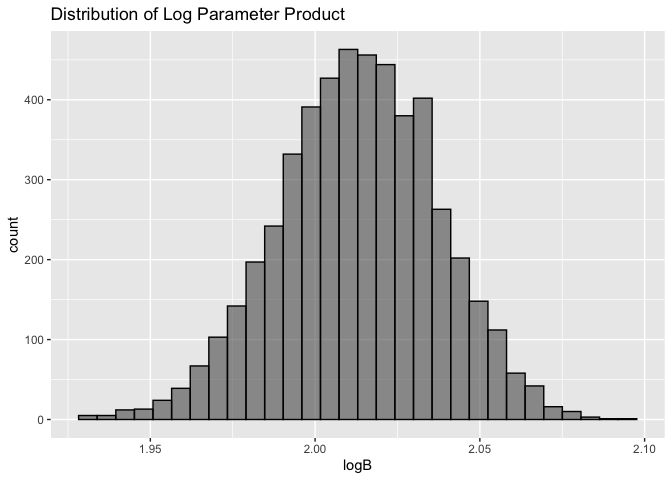

Homework 6
================
JR Chansakul
2020-12-09

``` r
library(tidyverse)
```

    ## ── Attaching packages ─────────────────────────────────────── tidyverse 1.3.0 ──

    ## ✓ ggplot2 3.3.2     ✓ purrr   0.3.4
    ## ✓ tibble  3.0.4     ✓ dplyr   1.0.2
    ## ✓ tidyr   1.1.2     ✓ stringr 1.4.0
    ## ✓ readr   1.3.1     ✓ forcats 0.5.0

    ## ── Conflicts ────────────────────────────────────────── tidyverse_conflicts() ──
    ## x dplyr::filter() masks stats::filter()
    ## x dplyr::lag()    masks stats::lag()

``` r
library(modelr)
library(p8105.datasets)
```

### Problem 1

``` r
homicide_df = 
  read_csv("data/homicide-data.csv", na = c("", "NA", "Unknown")) %>% 
  mutate(
    city_state = str_c(city, state, sep = ", "),
    victim_age = as.numeric(victim_age),
    resolution = case_when(
      disposition == "Closed without arrest" ~ 0,
      disposition == "Open/No arrest"        ~ 0,
      disposition == "Closed by arrest"      ~ 1)
  ) %>% 
  filter(
    victim_race %in% c("White", "Black"),
    city_state != "Tulsa, AL") %>% 
  select(city_state, resolution, victim_age, victim_race, victim_sex)
```

Start with one city.

``` r
baltimore_df =
  homicide_df %>% 
  filter(city_state == "Baltimore, MD")
glm(resolution ~ victim_age + victim_race + victim_sex, 
    data = baltimore_df,
    family = binomial()) %>% 
  broom::tidy() %>% 
  mutate(
    OR = exp(estimate),
    CI_lower = exp(estimate - 1.96 * std.error),
    CI_upper = exp(estimate + 1.96 * std.error)
  ) %>% 
  select(term, OR, starts_with("CI")) %>% 
  knitr::kable(digits = 3)
```

| term              |    OR | CI\_lower | CI\_upper |
| :---------------- | ----: | --------: | --------: |
| (Intercept)       | 1.363 |     0.975 |     1.907 |
| victim\_age       | 0.993 |     0.987 |     1.000 |
| victim\_raceWhite | 2.320 |     1.648 |     3.268 |
| victim\_sexMale   | 0.426 |     0.325 |     0.558 |

Try this across cities.

``` r
models_results_df = 
  homicide_df %>% 
  nest(data = -city_state) %>% 
  mutate(
    models = 
      map(.x = data, ~glm(resolution ~ victim_age + victim_race + victim_sex, data = .x, family = binomial())),
    results = map(models, broom::tidy)
  ) %>% 
  select(city_state, results) %>% 
  unnest(results) %>% 
  mutate(
    OR = exp(estimate),
    CI_lower = exp(estimate - 1.96 * std.error),
    CI_upper = exp(estimate + 1.96 * std.error)
  ) %>% 
  select(city_state, term, OR, starts_with("CI")) 
```

``` r
models_results_df %>% 
  filter(term == "victim_sexMale") %>% 
  mutate(city_state = fct_reorder(city_state, OR)) %>% 
  ggplot(aes(x = city_state, y = OR)) + 
  geom_point() + 
  geom_errorbar(aes(ymin = CI_lower, ymax = CI_upper)) + 
  theme(axis.text.x = element_text(angle = 90, hjust = 1))
```

<!-- -->

## Problem 2

# Load and clean the data for regression analysis

``` r
## Clean Data for Regression Analysis
birthweight_df = 
  read_csv("./data/birthweight.csv", na = c("", "NA", "Unknown")) %>%
  janitor::clean_names() %>% 
  mutate(babysex = as.factor(babysex), 
         malform = as.factor(malform),
         frace = as.factor(frace), 
         mrace = as.factor(mrace),
         babysex = recode(babysex, 
                          "1" = "Male", 
                          "2" = "Female"),
         frace = recode (frace,
                         "1" = "White", 
                         "2" = "Black", 
                         "3" = "Asian", 
                         "4" = "Puerto Rican",
                         "8" = "Other",
                         "9" = "Unknown"),
         malform = recode(malform, 
                          "0" = "absent",
                          "1" = "present"),
         mrace = recode(mrace,
                        "1" = "White", 
                        "2" = "Black", 
                        "3" = "Asian", 
                        "4" = "Puerto Rican", 
                        "8" = "Other"))
            
##Check for missing values - None 
sum(!complete.cases(birthweight_df))

## Check distributions and variable typles 
birthweight_df %>%
  skimr::skim()
```

# Regression method, modeling process and plot

``` r
## Full Model 
full_model = lm(bwt ~ ., data = birthweight_df)

## Backward Stepwise Regression Method  
step(full_model, direction = "backward") 
step(full_model, direction = "backward")[["terms"]]

## Fitted Model 
fitted_model1 = lm(bwt ~ babysex + bhead + blength + delwt + fincome + 
    gaweeks + mheight + mrace + parity + ppwt + smoken, data = birthweight_df)

summary(fitted_model1)

## Plot of model residuals against fitted values

birthweight_df %>% 
  modelr::add_residuals(fitted_model1) %>%
  modelr::add_predictions(fitted_model1) %>% 
  ggplot(aes(x = pred, y = resid)) + 
  geom_point(alpha = 0.2) +
  geom_hline(yintercept = 0, color = "blue")
```

<!-- -->

``` r
  labs(
    x = "Fitted Values",
    y = "Residuals",
    title = "Residuals against fitted values") +
  theme(plot.title = element_text(hjust = 0.5))
```

The first was fitting a full model that contains all variables provided
and then I used a backward function to perform a backward stepwise
regression to removed variables that are insignifcant with the outcome
of interest, baby’s birth weight. When I performed this stepwise
regression method, the babysex, bhead, blength, delwt, fincome, gaweeks,
mheight, mrace, parity, ppwt, and smoken variables were included into
the best fit model to compare with other models.

The residuals vs fitted values plot displays constant variance and that
the majority of the residuals fall around
0.

## Other Models

``` r
## Simple Model - One using length at birth and gestational age as predictors 
model2 = lm(bwt ~ blength + gaweeks, data = birthweight_df)

## Interaction Model - One using head circumference, length, sex, and all interactions 
model3 = lm(bwt ~ (bhead + blength + babysex)^3, birthweight_df)
```

## Comparison in terms of the cross-validated prediction error

``` r
## Cross Validation comparison 
cv_df = 
  crossv_mc(birthweight_df, 100) %>% 
  mutate(
    train = map(train, as_tibble),
    test = map(test, as_tibble))

cv_df = 
  cv_df %>% 
  mutate(
    fitted_model1 = map(train, ~lm(bwt ~ babysex + bhead + blength + delwt + fincome + gaweeks + mheight + mrace + parity + ppwt + smoken, data = .x)),
    model2 = map(train, ~lm(bwt ~ blength + gaweeks, data = .x)),
    model3 = map(train, ~lm(bwt ~ (bhead + blength + babysex)^3, data = .x))) %>% 
  mutate(
    rmse_mod1 = map2_dbl(fitted_model1, test, ~rmse(model = .x, data = .y)),
    rmse_mod2 = map2_dbl(model2, test, ~rmse(model = .x, data = .y)),
    rmse_mod3 = map2_dbl(model3, test, ~rmse(model = .x, data = .y)))

##RMSE Comparisons

cv_df %>%
  select(starts_with("rmse")) %>% 
  unnest() %>% 
  gather(key = "model", value = "rmse") %>% 
  mutate(model = 
           str_replace(model, "rmse_", "")) %>% 
  ggplot(aes(x = model, y = rmse)) +
  geom_violin(aes(fill = model)) + 
  labs(title = "RMSE Comparison") +
  theme(plot.title = element_text(hjust = 0.5))
```

<!-- -->

Out of the 3 violin plots, we can conclude that the stepwise regression
model has the lowest RMSE relative to model2 and model3, suggesting this
model best fits our data.

## Problem 3

``` r
## Import data 

weather_df = 
  rnoaa::meteo_pull_monitors(
    c("USW00094728"),
    var = c("PRCP", "TMIN", "TMAX"), 
    date_min = "2017-01-01",
    date_max = "2017-12-31") %>%
  mutate(
    name = recode(id, USW00094728 = "CentralPark_NY"),
    tmin = tmin / 10,
    tmax = tmax / 10) %>%
  select(name, id, everything())
```

    ## Registered S3 method overwritten by 'hoardr':
    ##   method           from
    ##   print.cache_info httr

    ## using cached file: /Users/aisarachansakul/Library/Caches/R/noaa_ghcnd/USW00094728.dly

    ## date created (size, mb): 2020-10-01 13:45:17 (7.519)

    ## file min/max dates: 1869-01-01 / 2020-09-30

## Plot the distribution of estimates

``` r
## Use boot_sample to draw bootstrap samples.

boot_sample = function(df) {
  sample_frac(df, replace = TRUE)
}

boot_straps = 
  data_frame(
    strap_number = 1:5000,
    strap_sample = rerun(5000, boot_sample(weather_df))
  )
```

``` r
## Clean and tidying dataset 
bootstrap_results = 
  boot_straps %>% 
  mutate(
    models = map(strap_sample, ~lm(tmax ~ tmin, data = .x)),
    results = map(models, broom::tidy),
    r_squared = map(models, broom::glance)) 

## Adjusted R-squared Plot
rsquared_df =
  bootstrap_results %>% 
  select(-strap_sample, -models) %>% 
  unnest(r_squared)
  
rsquared_df %>%   
  ggplot(aes(x = adj.r.squared)) + 
  geom_histogram(alpha = 0.6, color = "black") +
  labs(title="Distribution of Adj. R-Squared") +
    theme(plot.title = element_text(hjust = 0.5))
```

<!-- -->

``` r
## Log Parameter Product Plot
estimate_df = 
  bootstrap_results %>% 
  select(-strap_sample, -models) %>% 
  unnest(results) %>% 
  select(term, estimate) %>%
  pivot_wider(
    names_from = term,
    values_from = estimate
  ) %>% 
  unnest() %>% 
  rename (Intercept = '(Intercept)') %>%
  mutate(logB = log(tmin*Intercept)) 
  
estimate_df %>% 
  ggplot(aes(x = logB)) + 
  geom_histogram(alpha = 0.6, color = "black") +
  labs(title="Distribution of Log Parameter Product")
```

<!-- -->

The distribution for the adjusted R-squared values and log paramter plot
seem to be normally distributed. The adjusted R-square plot seems to
have a peak between 0.90 and 0.92, while the plot of log parameter
product plot had a peak between 2.00 and 2.025.

## 95% confidence interval Distributions

``` r
## CI for R-squared
  rsquared_df %>% 
  summarize(
    rsquared_CI_low = quantile(adj.r.squared, 0.025),
    rsquared_CI_upper = quantile(adj.r.squared, 0.975)
  )
```

    ## # A tibble: 1 x 2
    ##   rsquared_CI_low rsquared_CI_upper
    ##             <dbl>             <dbl>
    ## 1           0.894             0.928

``` r
## CI for Log Parameter Product
estimate_df %>%
  summarize(
    estimate_CI_low = quantile(logB, 0.025),
    estimate_CI_upper = quantile(logB, 0.975),
  )
```

    ## # A tibble: 1 x 2
    ##   estimate_CI_low estimate_CI_upper
    ##             <dbl>             <dbl>
    ## 1            1.97              2.06

The 95% CI of the adjusted r-squared is 0.8942087, 0.9277535 and of log
of the product is 1.965802, 2.0596902.
